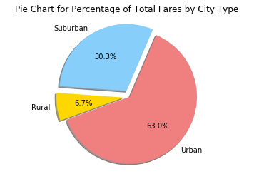

```python
# Import the dependencies
import pandas as pd
import numpy as np
import matplotlib.pyplot as plt
import csv
import os
from sklearn import preprocessing #Used for Normalized calculations
import seaborn as sb

```


```python
# Create path references for our 2 input CSV files - 1)city_data and 2)ride_data
city_data_path = "../raw_data/city_data.csv"
ride_data_path = "../raw_data/ride_data.csv"
```


```python
# Import the city_data CSV files to its respective dataframe
city_df = pd.read_csv(city_data_path, low_memory = False)
# Print the first five rows of data to the screen - just to be sure we have imported the CSV correctly
city_df.head()
```


<div>
<style scoped>
    .dataframe tbody tr th:only-of-type {
        vertical-align: middle;
    }

    .dataframe tbody tr th {
        vertical-align: top;
    }

    .dataframe thead th {
        text-align: right;
    }
</style>
<table border="1" class="dataframe">
  <thead>
    <tr style="text-align: right;">
      <th></th>
      <th>city</th>
      <th>driver_count</th>
      <th>type</th>
    </tr>
  </thead>
  <tbody>
    <tr>
      <th>0</th>
      <td>Kelseyland</td>
      <td>63</td>
      <td>Urban</td>
    </tr>
    <tr>
      <th>1</th>
      <td>Nguyenbury</td>
      <td>8</td>
      <td>Urban</td>
    </tr>
    <tr>
      <th>2</th>
      <td>East Douglas</td>
      <td>12</td>
      <td>Urban</td>
    </tr>
    <tr>
      <th>3</th>
      <td>West Dawnfurt</td>
      <td>34</td>
      <td>Urban</td>
    </tr>
    <tr>
      <th>4</th>
      <td>Rodriguezburgh</td>
      <td>52</td>
      <td>Urban</td>
    </tr>
  </tbody>
</table>
</div>


```python
# Import the ride_data CSV files to its respective dataframe
ride_df = pd.read_csv(ride_data_path, low_memory = False)
# Print the first five rows of data to the screen - just to be sure we have imported the CSV correctly
ride_df.head()
```


<div>
<style scoped>
    .dataframe tbody tr th:only-of-type {
        vertical-align: middle;
    }

    .dataframe tbody tr th {
        vertical-align: top;
    }

    .dataframe thead th {
        text-align: right;
    }
</style>
<table border="1" class="dataframe">
  <thead>
    <tr style="text-align: right;">
      <th></th>
      <th>city</th>
      <th>date</th>
      <th>fare</th>
      <th>ride_id</th>
    </tr>
  </thead>
  <tbody>
    <tr>
      <th>0</th>
      <td>Sarabury</td>
      <td>2016-01-16 13:49:27</td>
      <td>38.35</td>
      <td>5403689035038</td>
    </tr>
    <tr>
      <th>1</th>
      <td>South Roy</td>
      <td>2016-01-02 18:42:34</td>
      <td>17.49</td>
      <td>4036272335942</td>
    </tr>
    <tr>
      <th>2</th>
      <td>Wiseborough</td>
      <td>2016-01-21 17:35:29</td>
      <td>44.18</td>
      <td>3645042422587</td>
    </tr>
    <tr>
      <th>3</th>
      <td>Spencertown</td>
      <td>2016-07-31 14:53:22</td>
      <td>6.87</td>
      <td>2242596575892</td>
    </tr>
    <tr>
      <th>4</th>
      <td>Nguyenbury</td>
      <td>2016-07-09 04:42:44</td>
      <td>6.28</td>
      <td>1543057793673</td>
    </tr>
  </tbody>
</table>
</div>


```python
# Merge city and ride data dataframes into one combined dataframe
pyber_df = pd.merge(city_df, ride_df, on = "city", how = "outer")
pyber_df.head() # print the first 5 rows
```


<div>
<style scoped>
    .dataframe tbody tr th:only-of-type {
        vertical-align: middle;
    }

    .dataframe tbody tr th {
        vertical-align: top;
    }

    .dataframe thead th {
        text-align: right;
    }
</style>
<table border="1" class="dataframe">
  <thead>
    <tr style="text-align: right;">
      <th></th>
      <th>city</th>
      <th>driver_count</th>
      <th>type</th>
      <th>date</th>
      <th>fare</th>
      <th>ride_id</th>
    </tr>
  </thead>
  <tbody>
    <tr>
      <th>0</th>
      <td>Kelseyland</td>
      <td>63</td>
      <td>Urban</td>
      <td>2016-08-19 04:27:52</td>
      <td>5.51</td>
      <td>6246006544795</td>
    </tr>
    <tr>
      <th>1</th>
      <td>Kelseyland</td>
      <td>63</td>
      <td>Urban</td>
      <td>2016-04-17 06:59:50</td>
      <td>5.54</td>
      <td>7466473222333</td>
    </tr>
    <tr>
      <th>2</th>
      <td>Kelseyland</td>
      <td>63</td>
      <td>Urban</td>
      <td>2016-05-04 15:06:07</td>
      <td>30.54</td>
      <td>2140501382736</td>
    </tr>
    <tr>
      <th>3</th>
      <td>Kelseyland</td>
      <td>63</td>
      <td>Urban</td>
      <td>2016-01-25 20:44:56</td>
      <td>12.08</td>
      <td>1896987891309</td>
    </tr>
    <tr>
      <th>4</th>
      <td>Kelseyland</td>
      <td>63</td>
      <td>Urban</td>
      <td>2016-08-09 18:19:47</td>
      <td>17.91</td>
      <td>8784212854829</td>
    </tr>
  </tbody>
</table>
</div>


```python
# Export our dataframe as one CSV, without the Pandas index, but with the header
pyber_df.to_csv("../raw_data/pyber_tushaar.csv", index=False, header=True)
```


```python
# Performing some basic calculations to check the sanity of our data - like checking lengths of differnt columns
print (pyber_df.dtypes)
print (len (city_df["city"]))
print (len (ride_df["city"]))
print (len (pyber_df["city"]))
print (len (ride_df["city"].unique()))
print (len (city_df["city"].unique()))
print (len (pyber_df["city"].unique()))

# These are all optional calculations for me to check the lengths
```

    city             object
    driver_count      int64
    type             object
    date             object
    fare            float64
    ride_id           int64
    dtype: object
    126
    2375
    2407
    125
    125
    125


```python
# Creating 3 New DataFrames based on the City Types - Urban, Suburban and Rural
pyber_urban_df = pyber_df.loc[pyber_df["type"] == "Urban"]
pyber_suburban_df = pyber_df.loc[pyber_df["type"] == "Suburban"]
pyber_rural_df = pyber_df.loc[pyber_df["type"] == "Rural"]
# The above code used 'loc' function to create 3 different dataframes each split by Urban, Suburban and Rural city types
```


```python
# Core Calculations Module - This is my core calculations engine to perform most of the calculations needed for this assignment

# Calculations for Average Fare, Total Fare and Total Rides per each city type - Urban, Suburban and Rural

# Looking at the Urban Dataframe first

pyber_urban_city_df = pyber_urban_df.groupby(["city"]) # Creating a group by city view first for urban cities
average_fare_per_urban_city = pyber_urban_city_df["fare"].mean() # Calculating average fare
total_fare_per_urban_city = pyber_urban_city_df["fare"].sum() # Calculating total fare
total_rides_per_urban_city = pyber_urban_city_df["ride_id"].count() # Calculating total rides

total_fare_urban = total_fare_per_urban_city.sum() # Calculating total fare of all urban cities
total_rides_urban = total_rides_per_urban_city.sum() # Calculating total rides of all urban cities

#--------------------------------------------------------------------------------------

# Dropping duplicates for pyber_suburban df for Port James City
pyber_suburban_df_rem_dup = pyber_suburban_df.drop_duplicates(subset = ["ride_id"], keep = "first")
# Note, in the suburban cities (starting with our original City Dataframe), "Port James" is repeated twice = once with 15 and second with 3 for Driver Counts.

pyber_suburban_city_df = pyber_suburban_df_rem_dup.groupby(["city"]) # Creating a group by city view first for cities

average_fare_per_suburban_city = pyber_suburban_city_df["fare"].mean()# Calculating average fare
total_fare_per_suburban_city = pyber_suburban_city_df["fare"].sum()# Calculating total fare
total_rides_per_suburban_city = pyber_suburban_city_df["ride_id"].count() # Calculating total rides

total_fare_suburban = total_fare_per_suburban_city.sum()# Calculating total fare of all suburban cities

total_rides_suburban = len(pyber_suburban_city_df["ride_id"].value_counts())# Calculating total rides of all urban cities
total_rides_suburban_1 = total_rides_per_suburban_city.sum() #Used the sum to doublecheck my results which I achieved via length

#total_rides_suburban_1 and total_rides_suburban will give the exact same results

#--------------------------------------------------------------------------------------

pyber_rural_city_df = pyber_rural_df.groupby(["city"]) # Creating a group by city view first for cities
average_fare_per_rural_city = pyber_rural_city_df["fare"].mean()# Calculating average fare
total_fare_per_rural_city = pyber_rural_city_df["fare"].sum()# Calculating total fare
total_rides_per_rural_city = pyber_rural_city_df["ride_id"].count()# Calculating total rides

total_fare_rural = total_fare_per_rural_city.sum()# Calculating total fare for all rural cities
total_rides_rural = total_rides_per_rural_city.sum()# Calculating total rides of all rural cities

#--------------------------------------------------------------------------------------


# Calculating Total Fare and Total Rides - This data will be used for plotting percentages in the future

total_fare  = round((total_fare_urban + total_fare_suburban + total_fare_rural),2)
total_rides = total_rides_urban + total_rides_suburban + total_rides_rural

#--------------------------------------------------------------------------------------

# Calculations for Percentage of Total Fares per each city type - Urban, Suburban and Rural, rounded off to 1

urban_fare_percentage = round(((total_fare_urban/total_fare)*100),1)
suburban_fare_percentage = round(((total_fare_suburban/total_fare)*100),1)
rural_fare_percentage = round(((total_fare_rural/total_fare)*100),1)


#--------------------------------------------------------------------------------------

# Calculations for Percentage of Total Rides per each city type - Urban, Suburban and Rural

urban_ride_percentage = round(((total_rides_urban/total_rides)*100),1)
suburban_ride_percentage = round(((total_rides_suburban/total_rides)*100),1)
rural_ride_percentage = round(((total_rides_rural/total_rides)*100),1)
```


```python
# Calculations for Total Number of Drivers Per City
# Getting rid of duplicates
pyber_urban_df_unique = pyber_urban_df.drop_duplicates(subset=["city","driver_count"], keep='first')
pyber_suburban_df_unique = pyber_suburban_df.drop_duplicates(subset=["city","driver_count"], keep='first')
pyber_rural_df_unique = pyber_rural_df.drop_duplicates(subset=["city","driver_count"], keep='first')

# Now counting total number of drivers each for urban, suburban and rural cities
urban_drivers = pyber_urban_df_unique.groupby("city")["driver_count"].sum()
suburban_drivers = pyber_suburban_df_unique.groupby("city")["driver_count"].sum()
rural_drivers = pyber_rural_df_unique.groupby("city")["driver_count"].sum()

#--------------------------------------------------------------------------------------
```


```python
# Driver Count Calculations - Per City Type - Urban, Suburban and Rural
# Creating 3 New DataFrames based on the City Types - Urban, Suburban and Rural on the original city dataframe

city_urban_df = city_df.loc[city_df["type"] == "Urban"]
city_suburban_df = city_df.loc[city_df["type"] == "Suburban"]
city_rural_df = city_df.loc[city_df["type"] == "Rural"]

# Now counting total number of drivers each for urban, suburban and rural cities
total_drivers_urban = city_urban_df["driver_count"].sum()
total_drivers_suburban = city_suburban_df["driver_count"].sum()
total_drivers_rural = city_rural_df["driver_count"].sum()

#Total Drivers
total_drivers = city_df["driver_count"].sum()

#--------------------------------------------------------------------------------------

# Calculations for Percentage of Total Drivers per each city type - Urban, Suburban and Rural

urban_drivers_percentage = round(((total_drivers_urban/total_drivers)* 100),1)
suburban_drivers_percentage = round(((total_drivers_suburban/total_drivers)* 100),1)
rural_drivers_percentage = round(((total_drivers_rural/total_drivers)* 100),1)

#--------------------------------------------------------------------------------------
```


```python
print ("Total Urban Drivers are: " + str(total_drivers_urban))
print ("Total Suburban Drivers are: " + str(total_drivers_suburban))
print ("Total Rural Drivers are: " + str(total_drivers_rural))
print ("Total Pyber Drivers are:" + str(total_drivers_urban + total_drivers_suburban + total_drivers_rural))
```

    Total Urban Drivers are: 2607
    Total Suburban Drivers are: 638
    Total Rural Drivers are: 104
    Total Pyber Drivers are:3349


```python
# Now creating 3 dataframes - Urban, Suburban and Rural - these dataframes will be used for plotting our bubblecharts

urban_city_calcs_df = pd.DataFrame({"Average Fare ($) Per City": average_fare_per_urban_city,
                                    "Total Number of Rides Per City": total_rides_per_urban_city,
                                    "Total Number of Drivers Per City": urban_drivers
                                   },
                                   columns = ["Average Fare ($) Per City", "Total Number of Rides Per City", "Total Number of Drivers Per City"]
                                  )

suburban_city_calcs_df = pd.DataFrame({"Average Fare ($) Per City": average_fare_per_suburban_city,
                                    "Total Number of Rides Per City": total_rides_per_suburban_city,
                                    "Total Number of Drivers Per City": suburban_drivers
                                   },
                                   columns = ["Average Fare ($) Per City", "Total Number of Rides Per City", "Total Number of Drivers Per City"]
                                  )

rural_city_calcs_df = pd.DataFrame({"Average Fare ($) Per City": average_fare_per_rural_city,
                                    "Total Number of Rides Per City": total_rides_per_rural_city,
                                    "Total Number of Drivers Per City": rural_drivers
                                   },
                                   columns = ["Average Fare ($) Per City", "Total Number of Rides Per City", "Total Number of Drivers Per City"]
                                  )
```


```python
# Adding the City Type coloumn for each dataframe. This is needed for bubblechart.

urban_city_calcs_df ["City Type (Urban, Suburban, Rural)"] = "Urban"
suburban_city_calcs_df ["City Type (Urban, Suburban, Rural)"] = "Suburban"
rural_city_calcs_df ["City Type (Urban, Suburban, Rural)"] = "Rural"

```


```python
# Now creating a master aggregated dataframe - which will be used for our bubble plots

total_city_calcs_df = urban_city_calcs_df
total_city_calcs_df = total_city_calcs_df.append(suburban_city_calcs_df) 
total_city_calcs_df = total_city_calcs_df.append(rural_city_calcs_df) 
total_city_calcs_df.head()
bubble_chart_df = total_city_calcs_df
```


```python
# Data Preview for all Bubble Graphs and Plots....
```


```python
total_city_calcs_df.head()
```


<div>
<style scoped>
    .dataframe tbody tr th:only-of-type {
        vertical-align: middle;
    }

    .dataframe tbody tr th {
        vertical-align: top;
    }

    .dataframe thead th {
        text-align: right;
    }
</style>
<table border="1" class="dataframe">
  <thead>
    <tr style="text-align: right;">
      <th></th>
      <th>Average Fare ($) Per City</th>
      <th>Total Number of Rides Per City</th>
      <th>Total Number of Drivers Per City</th>
      <th>City Type (Urban, Suburban, Rural)</th>
    </tr>
    <tr>
      <th>city</th>
      <th></th>
      <th></th>
      <th></th>
      <th></th>
    </tr>
  </thead>
  <tbody>
    <tr>
      <th>Alvarezhaven</th>
      <td>23.928710</td>
      <td>31</td>
      <td>21</td>
      <td>Urban</td>
    </tr>
    <tr>
      <th>Alyssaberg</th>
      <td>20.609615</td>
      <td>26</td>
      <td>67</td>
      <td>Urban</td>
    </tr>
    <tr>
      <th>Antoniomouth</th>
      <td>23.625000</td>
      <td>22</td>
      <td>21</td>
      <td>Urban</td>
    </tr>
    <tr>
      <th>Aprilchester</th>
      <td>21.981579</td>
      <td>19</td>
      <td>49</td>
      <td>Urban</td>
    </tr>
    <tr>
      <th>Arnoldview</th>
      <td>25.106452</td>
      <td>31</td>
      <td>41</td>
      <td>Urban</td>
    </tr>
  </tbody>
</table>
</div>


```python
urban_city_calcs_df.head()
```


<div>
<style scoped>
    .dataframe tbody tr th:only-of-type {
        vertical-align: middle;
    }

    .dataframe tbody tr th {
        vertical-align: top;
    }

    .dataframe thead th {
        text-align: right;
    }
</style>
<table border="1" class="dataframe">
  <thead>
    <tr style="text-align: right;">
      <th></th>
      <th>Average Fare ($) Per City</th>
      <th>Total Number of Rides Per City</th>
      <th>Total Number of Drivers Per City</th>
      <th>City Type (Urban, Suburban, Rural)</th>
    </tr>
    <tr>
      <th>city</th>
      <th></th>
      <th></th>
      <th></th>
      <th></th>
    </tr>
  </thead>
  <tbody>
    <tr>
      <th>Alvarezhaven</th>
      <td>23.928710</td>
      <td>31</td>
      <td>21</td>
      <td>Urban</td>
    </tr>
    <tr>
      <th>Alyssaberg</th>
      <td>20.609615</td>
      <td>26</td>
      <td>67</td>
      <td>Urban</td>
    </tr>
    <tr>
      <th>Antoniomouth</th>
      <td>23.625000</td>
      <td>22</td>
      <td>21</td>
      <td>Urban</td>
    </tr>
    <tr>
      <th>Aprilchester</th>
      <td>21.981579</td>
      <td>19</td>
      <td>49</td>
      <td>Urban</td>
    </tr>
    <tr>
      <th>Arnoldview</th>
      <td>25.106452</td>
      <td>31</td>
      <td>41</td>
      <td>Urban</td>
    </tr>
  </tbody>
</table>
</div>


```python
suburban_city_calcs_df.head() 
```


<div>
<style scoped>
    .dataframe tbody tr th:only-of-type {
        vertical-align: middle;
    }

    .dataframe tbody tr th {
        vertical-align: top;
    }

    .dataframe thead th {
        text-align: right;
    }
</style>
<table border="1" class="dataframe">
  <thead>
    <tr style="text-align: right;">
      <th></th>
      <th>Average Fare ($) Per City</th>
      <th>Total Number of Rides Per City</th>
      <th>Total Number of Drivers Per City</th>
      <th>City Type (Urban, Suburban, Rural)</th>
    </tr>
    <tr>
      <th>city</th>
      <th></th>
      <th></th>
      <th></th>
      <th></th>
    </tr>
  </thead>
  <tbody>
    <tr>
      <th>Anitamouth</th>
      <td>37.315556</td>
      <td>9</td>
      <td>16</td>
      <td>Suburban</td>
    </tr>
    <tr>
      <th>Campbellport</th>
      <td>33.711333</td>
      <td>15</td>
      <td>26</td>
      <td>Suburban</td>
    </tr>
    <tr>
      <th>Carrollbury</th>
      <td>36.606000</td>
      <td>10</td>
      <td>4</td>
      <td>Suburban</td>
    </tr>
    <tr>
      <th>Clarkstad</th>
      <td>31.051667</td>
      <td>12</td>
      <td>21</td>
      <td>Suburban</td>
    </tr>
    <tr>
      <th>Conwaymouth</th>
      <td>34.591818</td>
      <td>11</td>
      <td>18</td>
      <td>Suburban</td>
    </tr>
  </tbody>
</table>
</div>


```python
rural_city_calcs_df.head()
```


<div>
<style scoped>
    .dataframe tbody tr th:only-of-type {
        vertical-align: middle;
    }

    .dataframe tbody tr th {
        vertical-align: top;
    }

    .dataframe thead th {
        text-align: right;
    }
</style>
<table border="1" class="dataframe">
  <thead>
    <tr style="text-align: right;">
      <th></th>
      <th>Average Fare ($) Per City</th>
      <th>Total Number of Rides Per City</th>
      <th>Total Number of Drivers Per City</th>
      <th>City Type (Urban, Suburban, Rural)</th>
    </tr>
    <tr>
      <th>city</th>
      <th></th>
      <th></th>
      <th></th>
      <th></th>
    </tr>
  </thead>
  <tbody>
    <tr>
      <th>East Leslie</th>
      <td>33.660909</td>
      <td>11</td>
      <td>9</td>
      <td>Rural</td>
    </tr>
    <tr>
      <th>East Stephen</th>
      <td>39.053000</td>
      <td>10</td>
      <td>6</td>
      <td>Rural</td>
    </tr>
    <tr>
      <th>East Troybury</th>
      <td>33.244286</td>
      <td>7</td>
      <td>3</td>
      <td>Rural</td>
    </tr>
    <tr>
      <th>Erikport</th>
      <td>30.043750</td>
      <td>8</td>
      <td>3</td>
      <td>Rural</td>
    </tr>
    <tr>
      <th>Hernandezshire</th>
      <td>32.002222</td>
      <td>9</td>
      <td>10</td>
      <td>Rural</td>
    </tr>
  </tbody>
</table>
</div>


```python
bubble_chart_df.head()
```


<div>
<style scoped>
    .dataframe tbody tr th:only-of-type {
        vertical-align: middle;
    }

    .dataframe tbody tr th {
        vertical-align: top;
    }

    .dataframe thead th {
        text-align: right;
    }
</style>
<table border="1" class="dataframe">
  <thead>
    <tr style="text-align: right;">
      <th></th>
      <th>Average Fare ($) Per City</th>
      <th>Total Number of Rides Per City</th>
      <th>Total Number of Drivers Per City</th>
      <th>City Type (Urban, Suburban, Rural)</th>
    </tr>
    <tr>
      <th>city</th>
      <th></th>
      <th></th>
      <th></th>
      <th></th>
    </tr>
  </thead>
  <tbody>
    <tr>
      <th>Alvarezhaven</th>
      <td>23.928710</td>
      <td>31</td>
      <td>21</td>
      <td>Urban</td>
    </tr>
    <tr>
      <th>Alyssaberg</th>
      <td>20.609615</td>
      <td>26</td>
      <td>67</td>
      <td>Urban</td>
    </tr>
    <tr>
      <th>Antoniomouth</th>
      <td>23.625000</td>
      <td>22</td>
      <td>21</td>
      <td>Urban</td>
    </tr>
    <tr>
      <th>Aprilchester</th>
      <td>21.981579</td>
      <td>19</td>
      <td>49</td>
      <td>Urban</td>
    </tr>
    <tr>
      <th>Arnoldview</th>
      <td>25.106452</td>
      <td>31</td>
      <td>41</td>
      <td>Urban</td>
    </tr>
  </tbody>
</table>
</div>


```python
print (len(urban_city_calcs_df))
print (len(suburban_city_calcs_df))
print (len(rural_city_calcs_df))
print (len(total_city_calcs_df))
print (len(bubble_chart_df))
```

    66
    41
    18
    125
    125


```python
# Export our dataframe as one CSV, without the Pandas index, but with the header
bubble_chart_df.to_csv("../raw_data/bubble_plot_tushaar.csv", index=False, header=True)
```


```python
# Data Preview for all the Pie Charts....
```


```python
print ("Raw Data for Total Fares by City Type")
print ("Total Urban Fare Percentage: " + str(urban_fare_percentage))
print ("Total Suburban Fare Percentage: " +str(suburban_fare_percentage))
print ("Total Rural Fare Percentage: "+ str(rural_fare_percentage))

print ("\nRaw Data for Total Rides by City Type")
print ("Total Urban Ride Percentage: "+ str(urban_ride_percentage))
print ("Total Suburban Ride Percentage: "+ str(suburban_ride_percentage))
print ("Total Rural Ride Percentage: "+ str(rural_ride_percentage))


print ("\nRaw Data for Total Drivers by City Type")
print ("Total Urban Drivers Percentage: "+ str(urban_drivers_percentage))
print ("Total Suburban Drivers Percentage: "+ str(suburban_drivers_percentage))
print ("Total Rural Drivers Percentage: "+ str(rural_drivers_percentage))

```

    Raw Data for Total Fares by City Type
    Total Urban Fare Percentage: 63.0
    Total Suburban Fare Percentage: 30.3
    Total Rural Fare Percentage: 6.7
    
    Raw Data for Total Rides by City Type
    Total Urban Ride Percentage: 68.4
    Total Suburban Ride Percentage: 26.3
    Total Rural Ride Percentage: 5.3
    
    Raw Data for Total Drivers by City Type
    Total Urban Drivers Percentage: 77.8
    Total Suburban Drivers Percentage: 19.1
    Total Rural Drivers Percentage: 3.1


```python
# Code for pie chart for Percentage of Total Fares by City Type

# Labels for the sections of our pie chart
labels = ["Urban", "Suburban", "Rural"]

# The values of each section of the pie chart
sizes = [urban_fare_percentage, suburban_fare_percentage, rural_fare_percentage]

# The colors of each section of the pie chart
colors = ["lightcoral", "lightskyblue", "gold"]

# Tells matplotlib to seperate the Suburban and Rural sections from the others
explode = (0, 0.1, 0.1)

# Creates the pie chart based upon the values above
# Automatically finds the percentages of each part of the pie chart
plt.pie(sizes, explode=explode, labels=labels, colors=colors,
        autopct="%1.1f%%", shadow=True, startangle=200)

# Create Title
plt.title("Pie Chart for Percentage of Total Fares by City Type")


# Tells matplotlib that we want a pie chart with equal axes
plt.axis("equal")
# Prints our pie chart to the screen
plt.show()

```





```python
# Code for pie chart for Percentage of Total Rides by City Type

# Labels for the sections of our pie chart
labels = ["Urban", "Suburban", "Rural"]

# The values of each section of the pie chart
sizes = [urban_ride_percentage, suburban_ride_percentage, rural_ride_percentage]

# The colors of each section of the pie chart
colors = ["lightcoral", "lightskyblue", "gold"]

# Tells matplotlib to seperate the Suburban and Rural sections from the others
explode = (0, 0.1, 0.1)

# Creates the pie chart based upon the values above
# Automatically finds the percentages of each part of the pie chart
plt.pie(sizes, explode=explode, labels=labels, colors=colors,
        autopct="%1.1f%%", shadow=True, startangle=200)

# Create Title
plt.title("Pie Chart for Percentage of Total Rides by City Type")


# Tells matplotlib that we want a pie chart with equal axes
plt.axis("equal")
# Prints our pie chart to the screen
plt.show()
```


```python
# Code for pie chart for Percentage of Total Drivers by City Type

# Labels for the sections of our pie chart
labels = ["Urban", "Suburban", "Rural"]

# The values of each section of the pie chart
sizes = [urban_drivers_percentage, suburban_drivers_percentage, rural_drivers_percentage]

# The colors of each section of the pie chart
colors = ["lightcoral", "lightskyblue", "gold"]

# Tells matplotlib to seperate the Suburban and Rural sections from the others
explode = (0, 0.1, 0.1)

# Creates the pie chart based upon the values above
# Automatically finds the percentages of each part of the pie chart
plt.pie(sizes, explode=explode, labels=labels, colors=colors,
        autopct="%1.1f%%", shadow=True, startangle=200)

# Create Title
plt.title("Pie Chart for Percentage of Total Drivers by City Type")


# Tells matplotlib that we want a pie chart with equal axes
plt.axis("equal")
# Prints our pie chart to the screen
plt.show()
```


```python
# Code for the bubble plot

# First create the main plot where we start with the urban city dataframe
main_plot = urban_city_calcs_df.plot(kind='scatter', x= 'Total Number of Rides Per City', 
                         y= "Average Fare ($) Per City", color = "lightcoral",edgecolors="black", 
                         grid=True,  figsize=(20,10), s=total_city_calcs_df["Total Number of Drivers Per City"]*10,  
                         legend = True, label = "Urban"
                        )

# Now we append suburban city dataframe to the main plot - via qualifier 'ax = main_plot'
suburban_city_calcs_df.plot(kind='scatter', x= 'Total Number of Rides Per City', 
                         y= "Average Fare ($) Per City", color = "lightskyblue",edgecolors="black", 
                         grid=True, figsize=(20,10),  s=total_city_calcs_df["Total Number of Drivers Per City"]*10,  
                         legend = True, label = "Suburban", ax = main_plot
                        )

# Now we again append rural city dataframe to the main plot - again via qualifier 'ax = main_plot'
rural_city_calcs_df.plot(kind='scatter', x= 'Total Number of Rides Per City', 
                         y= "Average Fare ($) Per City", color = "gold",edgecolors="black", 
                         grid=True, figsize=(20,10),  s=total_city_calcs_df["Total Number of Drivers Per City"]*10,  
                         legend = True, label = "Rural", ax = main_plot,
                        )

# Printing the labels and titles with their respective font sizes
plt.xlabel('Total Number of Rides Per City', fontsize = 15)
plt.ylabel("Average Fare ($) Per City", fontsize = 15)
plt.title("Tushaar's Pyber Ride Sharing Data", fontsize = 20)

# Printing annotation text with its respective font size
plt.annotate(s='Note:\nCircle size correlates with driver count per city',xy= (0,30), xytext=(17,46), fontsize = 17)

# Show the plot
plt.show()
```


```python
# Code from this point onwards is no longer needed
# ------------------------------------------------------------------------------------------------------------------
```


```python
pyber_city_df = pyber_df.groupby(["city"])
average_fare_per_city = pyber_city_df["fare"].mean()
total_rides_per_city = pyber_city_df["ride_id"].count()
total_drivers_per_city = pyber_city_df["driver_count"].unique()
city_type = pyber_city_df["type"].unique()
```


```python
pyber_city_calcs_df = pd.DataFrame({"Average Fare ($) Per City": average_fare_per_city,
                                    "Total Number of Rides Per City": total_rides_per_city,
                                    "Total Number of Drivers Per City": total_drivers_per_city,
                                    "City Type (Urban, Suburban, Rural)": city_type,
                                   },
                                   columns = ["Average Fare ($) Per City", "Total Number of Rides Per City", "Total Number of Drivers Per City", "City Type (Urban, Suburban, Rural)"]
                                  )
pyber_city_calcs_df.head()


```


<div>
<style scoped>
    .dataframe tbody tr th:only-of-type {
        vertical-align: middle;
    }

    .dataframe tbody tr th {
        vertical-align: top;
    }

    .dataframe thead th {
        text-align: right;
    }
</style>
<table border="1" class="dataframe">
  <thead>
    <tr style="text-align: right;">
      <th></th>
      <th>Average Fare ($) Per City</th>
      <th>Total Number of Rides Per City</th>
      <th>Total Number of Drivers Per City</th>
      <th>City Type (Urban, Suburban, Rural)</th>
    </tr>
    <tr>
      <th>city</th>
      <th></th>
      <th></th>
      <th></th>
      <th></th>
    </tr>
  </thead>
  <tbody>
    <tr>
      <th>Alvarezhaven</th>
      <td>23.928710</td>
      <td>31</td>
      <td>[21]</td>
      <td>[Urban]</td>
    </tr>
    <tr>
      <th>Alyssaberg</th>
      <td>20.609615</td>
      <td>26</td>
      <td>[67]</td>
      <td>[Urban]</td>
    </tr>
    <tr>
      <th>Anitamouth</th>
      <td>37.315556</td>
      <td>9</td>
      <td>[16]</td>
      <td>[Suburban]</td>
    </tr>
    <tr>
      <th>Antoniomouth</th>
      <td>23.625000</td>
      <td>22</td>
      <td>[21]</td>
      <td>[Urban]</td>
    </tr>
    <tr>
      <th>Aprilchester</th>
      <td>21.981579</td>
      <td>19</td>
      <td>[49]</td>
      <td>[Urban]</td>
    </tr>
  </tbody>
</table>
</div>


```python
total_city_calcs_df_ascending = total_city_calcs_df.sort_values("Total Number of Rides Per City", ascending = False)

total_city_calcs_df_ascending.head()


```


<div>
<style scoped>
    .dataframe tbody tr th:only-of-type {
        vertical-align: middle;
    }

    .dataframe tbody tr th {
        vertical-align: top;
    }

    .dataframe thead th {
        text-align: right;
    }
</style>
<table border="1" class="dataframe">
  <thead>
    <tr style="text-align: right;">
      <th></th>
      <th>Average Fare ($) Per City</th>
      <th>Total Number of Rides Per City</th>
      <th>Total Number of Drivers Per City</th>
      <th>City Type (Urban, Suburban, Rural)</th>
    </tr>
    <tr>
      <th>city</th>
      <th></th>
      <th></th>
      <th></th>
      <th></th>
    </tr>
  </thead>
  <tbody>
    <tr>
      <th>Swansonbury</th>
      <td>27.464706</td>
      <td>34</td>
      <td>64</td>
      <td>Urban</td>
    </tr>
    <tr>
      <th>Port Johnstad</th>
      <td>25.882941</td>
      <td>34</td>
      <td>22</td>
      <td>Urban</td>
    </tr>
    <tr>
      <th>Port James</th>
      <td>31.806562</td>
      <td>32</td>
      <td>18</td>
      <td>Suburban</td>
    </tr>
    <tr>
      <th>South Louis</th>
      <td>27.087500</td>
      <td>32</td>
      <td>12</td>
      <td>Urban</td>
    </tr>
    <tr>
      <th>Alvarezhaven</th>
      <td>23.928710</td>
      <td>31</td>
      <td>21</td>
      <td>Urban</td>
    </tr>
  </tbody>
</table>
</div>


